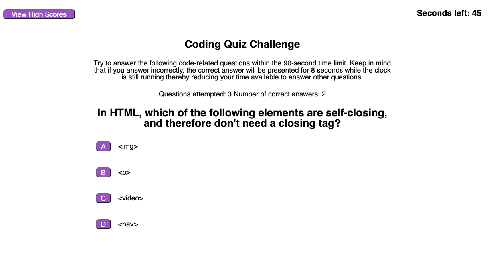

# javascript-quiz

---

## Technology Used 

| Technology Used         | Resource URL           | 
| ------------- |:-------------:| 
| HTML    | [https://developer.mozilla.org/en-US/docs/Web/HTML](https://developer.mozilla.org/en-US/docs/Web/HTML) | 
| CSS     | [https://developer.mozilla.org/en-US/docs/Web/CSS](https://developer.mozilla.org/en-US/docs/Web/CSS)      |
| JavaScript     | [https://developer.mozilla.org/en-US/docs/Web/JavaScript](https://developer.mozilla.org/en-US/docs/Web/JavaScript)      |   
| Git | [https://git-scm.com/](https://git-scm.com/)     |    

---

## Description

[Visit the Deployed Site](https://jeffreydne.github.io/Jeff-Nelson-javascript-quiz)

This is a timed quiz on javascrit, css and html. Once the user starts the quiz they have 90 seconds to complete 12 questions. when they answer incorrectly 8 seconds are deducted. At the end, the user can record their score in local storage and compare how they did to others, or to their previous attempts.


---

## Code Example

The below JavaScript example shows 
XXXXX
XXXXX
XXXXX

```JS
 // XXXXX
 //XXXXX
 
```
XXXXX
XXXXX

```JS
  //This needs to be filled in
```
## Usage

This webstie is designed to be a learning tool to help people in software development to test their knowledge about HTML, CSS and JavaScript. To do this they can take a timed quiz which will help the user clarify what concepts they already know, and what areas need more study. The quiz is timed and the score is tracked. At the end they can enter their scoree and compare it to the high scores of others, or to their previous attempts. 



---

## Learning Points

During the making of this quiz I devloped this website from scratch, based on a model suggested by the UC Berkeley Extension Full Stack Bootcamp. I implemented basic HTML and CSS such that my site looked similar to the screenshots provided. I used JavaScript to provide the logic for setting up a timed quiz that manipulated the DOM to provide questions, evaluate the user's answers, keep track of the score and provide them with results at the end, all while keeping in mind best practices. 

* XXXX

* XXXX

* XXXX

*  XXXX

* XXXXX

* XXXXX

* XXXX 
---

## Author Info

```md
### Jeffrey Nelson


* [Portfolio]( https://jeffreydne.github.io/Jeff-Nelson-Portfolio/)
* [LinkedIn](https://www.linkedin.com/in/jeffrey-nelson13/)
* [Github](https://github.com/Jeffreydne)
```

---
## Credits
 The excellent staff at UC Berkeley Extension Full Stack Bootcamp provided the beginings of the table of technology used in this README.md. 
 To store scores using localStorage, I borrowed heavily from the web storage tutorial at freeCodeCamp.org, modifying as needed.
